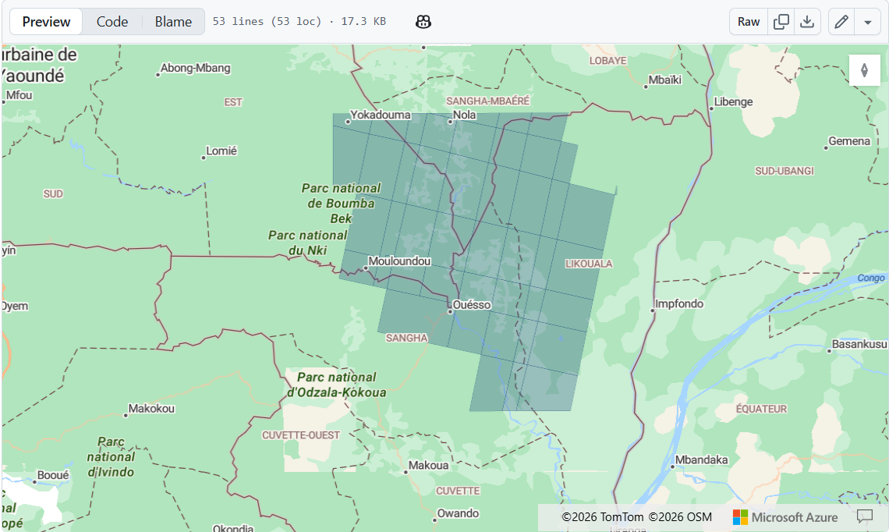

# Méthode 1: Méthode K-means (classification non-supervisée)

## Mosaïque et calcul K-means sur GEE

Le Tri-National de la Sangha se trouvant en région tropicale humide, les images satellitaires propres sans perturbations atmosphériques sont difficilement accessibles et même agglomérer les images Landsat ou Sentinel-2 avec un couvert nuageux faible de moins de 30% sur 1 an ne couvre pas tout le territoire forestier. 
Il faut ajouter à cela que le cacao dans le TNS pousse sous canopée dans des petites exploitations familiales et qu'il est donc difficilement repérable. 
En l'absence d'un nombre suffisant de champs de cacao pour permettre une détection par machine learning, et après de nombreux tests sur des données images, la première méthode a été de mosaïquer les images Landsat du territoire sur 1 an et demi puis découper l'image obtenue. 
On a ainsi divisé le TNS en 48 entités en fonction des coutures (discontinuités dues aux conditions de prise des images) afin d'effacer cet obstacle à l'identification du cacao.
Compte tenu de la mauvaise connaissance du territoire, c'est le K-means qui a été choisi pour partager les images en 20 classes du sol. 
Un nombre plus grand de couches pourrait être envisagé car toutes les parties du TNS n'ont pas la même amplitude QGIS ne supportant pas les opérations trop lourdes, les étapes sus-mentionnées seront réalisées en JavaScript sur Google Earth Engine



<script>
// == Imports ==

var zone = table.geometry();


// == Collections Landsat 8/9 ==

var L8 = ee.ImageCollection('LANDSAT/LC08/C02/T1_L2');
var L9 = ee.ImageCollection('LANDSAT/LC09/C02/T1_L2');

var col = L8.merge(L9);


// == Filtrage ==

var images = col
  .filterBounds(zone)
  .filterDate('2025-01-01', '2026-06-01')
  .filter(ee.Filter.lt('CLOUD_COVER', 30));

print('Nombre images :', images.size());


// == Masque de nuages ==

function mask(image) {

  var qa = image.select('QA_PIXEL');

  var mask = qa.bitwiseAnd(1 << 1).eq(0)
    .and(qa.bitwiseAnd(1 << 2).eq(0))
    .and(qa.bitwiseAnd(1 << 3).eq(0))
    .and(qa.bitwiseAnd(1 << 4).eq(0));

  return image.updateMask(mask);
}


// == Scale Factor USGS ==

function scale(image) {

  var optical = image.select([
    'SR_B2',
    'SR_B3',
    'SR_B4',
    'SR_B5',
    'SR_B6',
    'SR_B7'
  ])
  .multiply(0.0000275)
  .add(-0.2);

  return image.addBands(optical, null, true);
}


// == Mosaïque ==

var mosaic = images
  .map(mask)
  .map(scale)
  .median()
  .clip(zone);


// == Bandes K-means ==

var bands = [
  'SR_B2',
  'SR_B3',
  'SR_B4',
  'SR_B5',
  'SR_B6',
  'SR_B7'
];


// == Composition colorée RGB ==

Map.centerObject(table,8);


Map.addLayer(
  mosaic,
  {
    bands:[
      'SR_B4',
      'SR_B3',
      'SR_B2'
    ],
    min:0,
    max:0.3
  },
  'RGB'
);


Map.addLayer(
  table,
  {},
  'Polygones'
);


// == K-MEANS INDÉPENDANTS ==

var nb = table.size().getInfo();

print('Nombre polygones :', nb);


var list = table.toList(nb);


for (var i = 0; i < nb; i++) {


  var feature = ee.Feature(list.get(i));


  var geom = feature.geometry();


  // image locale

  var imgPoly = mosaic.clip(geom);


  // échantillonnage local

  var training = imgPoly
    .select(bands)
    .sample({

      region: geom,

      scale:30,

      numPixels:3000,

      geometries:false

    });


  // K-means propre au polygone

  var clusterer = ee.Clusterer
    .wekaKMeans(20)
    .train(training);


  // classification

  var clustered = imgPoly
    .select(bands)
    .cluster(clusterer)
    .toByte();


  // == Affichage des 48 rasters ==

  Map.addLayer(

    clustered,

    {

      min:0,

      max:19,

      palette:[

        'blue',
        'green',
        'yellow',
        'red',
        'purple',
        'orange',
        'cyan',
        'brown',
        'pink',
        'gray',
        'lime',
        'magenta',
        'teal',
        'navy',
        'white',
        'black',
        'gold',
        'coral',
        'violet',
        'darkgreen'

      ]

    },

    'KMEANS_' + (i+1),

    false

  );


  // == Export Google Drive dans le fichier GEE_Exports ==


  Export.image.toDrive({

    image: clustered,

    description:
      'KMEANS_' + (i+1),

    folder:
      'GEE_Exports',

    fileNamePrefix:
      'KMEANS_' + (i+1),

    region:
      geom,

    scale:
      30,

    maxPixels:
      1e13

  });


}
</script>

## Comparaison NIR-classification

Les 48 images sont ensuite extraites de Google Drive pour être traitées dans QGIS: c'est là que l'utilisateur va rassembler manuellement les 20 classes en 6 classes parmi lesquelles l'agroforesterie sous ombrage.
En se servant exclusivement des images NIR (proche-infrarouge) qui distinguent bien les agroforesteries sous ombrage et du NDVI, l'utilisateur pourra trier la ou les classes qui sont le plus susceptibles d'en faire partie.
Une fois le périmètre d'agroforêts suspectées cerné, il est nécessaire de croiser ces données avec les connaissances du terrain, les cartographies participatives et d'autres jeux de données tel le Global Canopy Height.


# Méthode 2: Comparaison NIR saisonnière

## Mosaïque et calcul K-means sur GEE


<script>
// == ROI ==

var roi = ee.Geometry.Rectangle([
  14.9,
  0.6,
  17.7,
  3.6
]);

Map.centerObject(roi, 8);
Map.addLayer(roi, {}, 'ROI');

// == Collaction Landsat ==

var Landsat = ee.ImageCollection("LANDSAT/LC08/C02/T1_L2")
  .merge(ee.ImageCollection("LANDSAT/LC09/C02/T1_L2"));


// == Fonction création des saisons ==

function buildSeason(years, startMonth, startDay, endMonth, endDay){

  var collection = ee.ImageCollection([]);

  years.forEach(function(year){

    var start = ee.Date.fromYMD(year, startMonth, startDay);

    var end;

    if(startMonth > endMonth){
      end = ee.Date.fromYMD(year + 1, endMonth, endDay);
    } else {
      end = ee.Date.fromYMD(year, endMonth, endDay);
    }

    var img = Landsat
      .filterBounds(roi)
      .filterDate(start, end)
      .filter(ee.Filter.lt('CLOUD_COVER',30))
      .median()
      .clip(roi);

    // Réflectance Landsat L2

    var red = img
      .select('SR_B4')
      .multiply(0.0000275)
      .add(-0.2)
      .rename('RED');

    var nir = img
      .select('SR_B5')
      .multiply(0.0000275)
      .add(-0.2)
      .rename('NIR');

    var ndvi = nir
      .subtract(red)
      .divide(nir.add(red))
      .rename('NDVI');

    var result = ee.Image.cat([
      red,
      nir,
      ndvi
    ]);

    collection = collection.merge(
      ee.ImageCollection([result])
    );

  });

  return collection.median().clip(roi);

}


// == Périodes ==

var years = [2023, 2024, 2025];

// Saison sèche
var Dry = buildSeason(
  years,
  11,
  16,
  3,
  15
);

// Saison humide
var Wet = buildSeason(
  years,
  3,
  1,
  11,
  30
);


// == Extraction des images ==

var Dry_RED = Dry.select('RED');
var Dry_NIR = Dry.select('NIR');
var Dry_NDVI = Dry.select('NDVI');

var Wet_RED = Wet.select('RED');
var Wet_NIR = Wet.select('NIR');
var Wet_NDVI = Wet.select('NDVI');


// == Visualisation ==

Map.addLayer(Dry_RED,{min:0,max:0.3},'Dry RED');

Map.addLayer(Dry_NIR,{min:0,max:0.5},'Dry NIR');

Map.addLayer(
  Dry_NDVI,
  {
    min:-0.2,
    max:0.9,
    palette:['brown','yellow','green']
  },
  'Dry NDVI'
);

Map.addLayer(Wet_RED,{min:0,max:0.3},'Wet RED');

Map.addLayer(Wet_NIR,{min:0,max:0.5},'Wet NIR');

Map.addLayer(
  Wet_NDVI,
  {
    min:-0.2,
    max:0.9,
    palette:['brown','yellow','green']
  },
  'Wet NDVI'
);


// == Exports vers QGIS_Export ==

Export.image.toDrive({
  image: Dry_RED,
  description:'Dry_RED_2023_2025',
  folder:'QGIS_EXPORT',
  region:roi,
  scale:30,
  maxPixels:1e13
});

Export.image.toDrive({
  image: Dry_NIR,
  description:'Dry_NIR_2023_2025',
  folder:'QGIS_EXPORT',
  region:roi,
  scale:30,
  maxPixels:1e13
});

Export.image.toDrive({
  image: Dry_NDVI,
  description:'Dry_NDVI_2023_2025',
  folder:'QGIS_EXPORT',
  region:roi,
  scale:30,
  maxPixels:1e13
});

Export.image.toDrive({
  image: Wet_RED,
  description:'Wet_RED_2023_2025',
  folder:'QGIS_EXPORT',
  region:roi,
  scale:30,
  maxPixels:1e13
});

Export.image.toDrive({
  image: Wet_NIR,
  description:'Wet_NIR_2023_2025',
  folder:'QGIS_EXPORT',
  region:roi,
  scale:30,
  maxPixels:1e13
});

Export.image.toDrive({
  image: Wet_NDVI,
  description:'Wet_NDVI_2023_2025',
  folder:'QGIS_EXPORT',
  region:roi,
  scale:30,
  maxPixels:1e13
});
</script>

## Comparaison NIR-Saisons

Cette fois, la classification n'est pas utilisée du tout ! On sépare juste les zones qu'on soupçonne agroforestières sous ombrage. Cette fois, on a une image NIR en période "sèche" et une en période "humide".
En période de pluies fortes et de maximum végétatif (début mars- fin novembre) les agroforêts sous ombrage, plus jeunes émettent fortement dans le proche infrarouge, plus que les forêts mais moins que les cultures à ciel ouvert. En période de déclin végétatif ou de moindres pluies (début décembre- fin février) leur réflectance moyenne dans le proche infrarouge les distingue du reste de la végétation et particulièrement des cultures à ciel ouvert qui n'émettent plus dans ces longueurs d'onde. En augmentant les contrastes des images, les agroforêts sous ombrages deviennent évidentes. Le NDVI des agroforêts est aussi plus fort que celui des forêts primaires aux alentours. Aussi, les cultures à ciel ouvert ont après observation des valeurs de rouge plus élevées que les agroforêts.
En choisissant un seuil NIR_humide > 0.35, on obtient les zones avec un NIR très élevé (cultures à ciel ouvert et agroforesteries sous canopée). Pour n'obtenir que les agroforesteries sous canopée, on peut discrimier les champs ouverts en choisissant un seuil RED_humide >  (les images en saison humide étant plus propres).
Aussi, en appliquant un seuil NIR_sec > , on peut obtenir directement les agroforesteries sous canopée bien que moins visibles (d'où l'utilité du NIR_humide). 
Ce test reste toutefois assez sommaire et bien moins précis que la cartographie du cacao de la FAO, produite par machine-learning. Pour effacer les potentiels faux-positifs, on peut lisser les résultats avec un filtre médian sur R:

```{r}
library(terra)

# Charger le raster
r <- rast("./AGROFOREST.tif")

# Filtre médian 3x3
r_med <- focal(r,
               w = matrix(1, 3, 3),
               fun = median,
               na.rm = TRUE)

# Export correct
writeRaster(r_med,
            filename = "./AGROFOREST_lissee.tif",
            format = "GTiff",
            overwrite = TRUE)
```


# Méthode 1: Méthode SBR SWIR1/NIR

## Raisonnement

La canopée est souvent moins fermée et plus hétérogène en agroforêts sous ombrage qu'en forêt primaire. On s'attend donc à un proche-infrarouge (Bande 5) élevé et un infrarouge à ondes courtes élevé (Bande 6) et un rapport Bande 6/Bande 5 ou SBR faible. En utilisant les images Sentinel-2, cette fois-ci, on parvient à un résultat prometteur.

<script>
// =====================
// ROI
// =====================

var roi = ee.Geometry.Rectangle([
  14.9,
  1.8,
  15.7,
  3.6
]);

Map.centerObject(roi, 8);
Map.addLayer(roi, {}, 'ROI');


// =====================
// COLLECTION LANDSAT
// =====================

var Sentinel2 = ee.ImageCollection("COPERNICUS/S2_SR_HARMONIZED");
  

// =====================
// FILTRE
// =====================

var images = Sentinel2
  .filterBounds(roi)
  .filterDate('2021-01-01', '2026-04-08')
  .filter(ee.Filter.lt('CLOUDY_PIXEL_PERCENTAGE', 10));

print('Nombre d\'images :', images.size());

// =====================
// MASQUE QA_PIXEL
// =====================

function maskLandsat(image){

  var qa = image.select('QA_PIXEL');

  var mask = qa.bitwiseAnd(1 << 1).eq(0)   // Dilated cloud
    .and(qa.bitwiseAnd(1 << 2).eq(0))      // Cirrus
    .and(qa.bitwiseAnd(1 << 3).eq(0))      // Cloud
    .and(qa.bitwiseAnd(1 << 4).eq(0));     // Cloud shadow

  return image.updateMask(mask);

}

// =====================
// AJOUT DU SBR
// SBR = SWIR1 / NIR
// =====================

function addSBR(image){

  var nir = image
    .select('B5')
    .multiply(0.0000275)
    .add(-0.2);

  var swir1 = image
    .select('B6')
    .multiply(0.0000275)
    .add(-0.2);

  var sbr = swir1
    .divide(nir)
    .rename('SBR');

  return image.addBands(sbr);

}

var imagesSBR = images.map(addSBR);


// =====================
// INFORMATIONS
// =====================

print(
  'Dates :',
  imagesSBR.aggregate_array('DATE_ACQUIRED')
);

print(
  'Produits :',
  imagesSBR.aggregate_array('LANDSAT_PRODUCT_ID')
);


// =====================
// PREMIERE IMAGE
// =====================

var first = ee.Image(imagesSBR.first());

Map.addLayer(
  first.clip(roi),
  {
    bands:['B4','B3','B2'],
    min:7000,
    max:18000
  },
  'Première image RGB'
);

Map.addLayer(
  first.select('SBR').clip(roi),
  {
    min:0.5,
    max:2,
    palette:[
      'blue',
      'cyan',
      'yellow',
      'orange',
      'red'
    ]
  },
  'SBR première image'
);


// =====================
// COMPOSITE MEDIAN
// =====================

var nirMedian = imagesSBR
  .select('B5')
  .median()
  .multiply(0.0000275)
  .add(-0.2)
  .clip(roi);

Map.addLayer(
  nirMedian,
  {
    min:0,
    max:0.5
  },
  'NIR médian'
);

var sbrMedian = imagesSBR
  .select('SBR')
  .median()
  .clip(roi);

Map.addLayer(
  sbrMedian,
  {
    min:0.5,
    max:2,
    palette:[
      'blue',
      'cyan',
      'yellow',
      'orange',
      'red'
    ]
  },
  'SBR médian'
);


// =====================
// UNION DE TOUS LES PIXELS
// AYANT UN SBR >= 0.9
// =====================

var maskCollection = imagesSBR.map(function(image){

  return image
    .select('SBR')
    .gte(0.9)
    .rename('SBR_mask');

});

var unionMask = maskCollection
  .max()
  .clip(roi);


// =====================
// VISUALISATION
// =====================

Map.addLayer(
  unionMask,
  {
    min:0,
    max:1,
    palette:[
      'black',
      'red'
    ]
  },
  'Union SBR >= 0.9'
);


// =====================
// EXPORT
// =====================

Export.image.toDrive({

  image: nirMedian,

  description: 'NIR_Median_2021_2026',

  folder: 'QGIS_EXPORT',

  region: roi,

  scale: 30,

  maxPixels: 1e13

});

Export.image.toDrive({

  image: unionMask,

  description:'Union_SBR_08_2021_2026',

  folder:'QGIS_EXPORT',

  region:roi,

  scale:30,

  maxPixels:1e13

});

Export.image.toDrive({

  image: sbrMedian,

  description: 'SBR_Median_2021_2026',

  folder: 'QGIS_EXPORT',

  region: roi,

  scale: 30,

  maxPixels: 1e13

});
</script>


